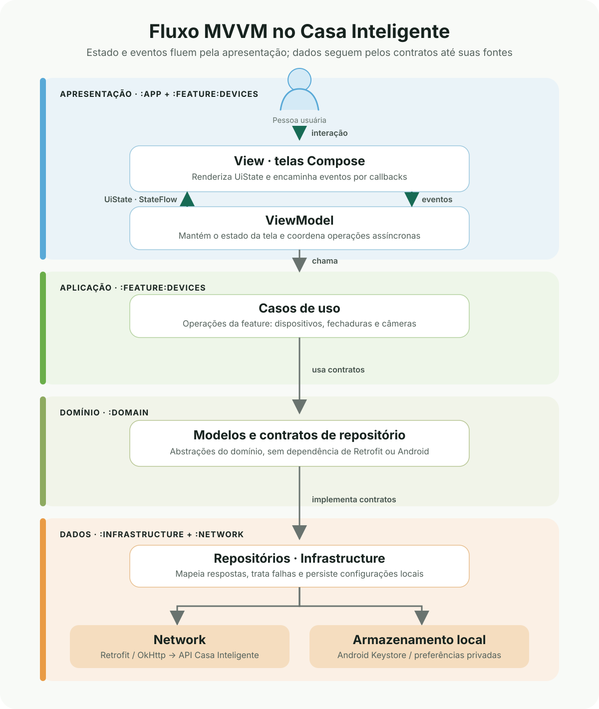

# Casa Inteligente

Aplicativo Android para consultar e controlar dispositivos vinculados a uma conta Casa Inteligente Intelbras. A conexão usa um token temporário de acesso; após autenticar, a pessoa pode consultar dispositivos, controlar fechaduras e iniciar uma transmissão de câmera quando o serviço e a conta permitirem.

## Funcionalidades

- Conexão usando token temporário do portal Open Casa Inteligente, com opção de mostrar, ocultar ou colar o token.
- Consulta paginada de dispositivos, com filtros para todos, vinculados e compartilhados.
- Exibição de categoria, modelo, estado online e identificação do dispositivo.
- Controle de fechaduras: consulta de estado, abertura e fechamento, abertura remota, volume e histórico.
- Histórico local de ações de abertura e fechamento, separado por conta e dispositivo.
- Consulta de cota e criação e encerramento de sessões de vídeo para câmeras compatíveis.
- Mensagens específicas para falhas comuns, como token inválido ou expirado, falta de permissão, ausência de conexão e indisponibilidade do serviço.

O acesso a dispositivos e recursos depende das permissões da conta e da disponibilidade da API Intelbras.

## Arquitetura

O aplicativo combina Clean Architecture com MVVM. MVVM separa a apresentação em três responsabilidades: a **View** mostra a interface, o **ViewModel** mantém e atualiza o estado da tela, e o **Model** fornece os dados e as operações de que a tela precisa. Neste projeto, o Model não é uma classe única: ele é formado pelos casos de uso, contratos e modelos de domínio, repositórios e fontes de dados.

### Como o MVVM funciona neste app

1. **View — telas Compose:** apresenta o estado atual e envia eventos do usuário ao ViewModel, como conectar uma conta, selecionar um filtro ou acionar uma fechadura. Os componentes visuais recebem estado e callbacks; eles não fazem chamadas HTTP nem acessam preferências.
2. **ViewModel — estado e coordenação:** cada fluxo tem um estado próprio, como `DevicesState` ou `LockState`. O ViewModel expõe esse estado como `StateFlow` somente leitura e recebe as ações da tela. Para operações assíncronas, usa coroutines e casos de uso; então publica um novo estado com dados, carregamento ou erro.
3. **Model — dados e regras:** os casos de uso da feature coordenam operações; os contratos e modelos do módulo `domain` definem o que a aplicação precisa sem depender de Retrofit ou de componentes visuais. O módulo `infrastructure` implementa esses contratos, converte DTOs e persiste dados.

O fluxo de estado é unidirecional: a tela observa o `StateFlow` com `collectAsStateWithLifecycle`, renderiza o valor atual e envia eventos ao ViewModel. Quando o ViewModel atualiza o estado, o Compose recompõe os elementos que dependem dele. Assim, o estado da interface fica explícito e sobrevive a recomposições sem colocar regras de negócio dentro dos composables.



A direção das dependências mantém a apresentação separada dos detalhes de rede e armazenamento. O Hilt conecta as implementações aos contratos em tempo de execução; ViewModels não precisam conhecer Retrofit, OkHttp ou a implementação concreta dos repositórios.

### Módulos

| Módulo | Responsabilidade |
| --- | --- |
| `:app` | Inicialização, tema, navegação raiz e composição das dependências do aplicativo. |
| `:feature:devices` | Fluxos de conexão, lista de dispositivos, fechaduras e câmeras; telas Compose, ViewModels e casos de uso da feature. |
| `:domain` | Modelos e contratos de repositório independentes de Android e de detalhes de rede. |
| `:infrastructure` | Implementações dos repositórios, mapeamento de respostas, persistência local e tratamento de falhas. |
| `:network` | Configuração HTTP, autenticação Bearer, `CasaApi` e DTOs de requisição e resposta. |

O Hilt configura a injeção de dependências entre os módulos. ViewModels expõem estado observável por `StateFlow` e executam operações assíncronas com coroutines.

## Tecnologias

- Kotlin e Android Gradle Plugin
- Jetpack Compose e Material 3
- ViewModel, Lifecycle e Navigation Compose
- Coroutines e Flow
- Retrofit, OkHttp e Moshi
- Hilt e KSP
- JUnit 4, MockWebServer, Robolectric e testes instrumentados AndroidX

## Requisitos de desenvolvimento

- Android Studio com JDK 17 (o JDK incluído no Android Studio atende a esse requisito).
- Android SDK Platform 37.
- Um emulador ou dispositivo Android com API 26 ou superior para executar o aplicativo; o `minSdk` é 26.
- Acesso à internet para baixar dependências Gradle e consultar a API.

Abra a pasta raiz no Android Studio e aguarde a sincronização do Gradle. O projeto não exige arquivo de configuração local para definir o endereço da API: o host de produção está definido em `network`.

## Compilar e executar

No Windows PowerShell:

```powershell
.\gradlew.bat :app:assembleDebug
.\gradlew.bat :app:installDebug
```

No macOS ou Linux:

```bash
./gradlew :app:assembleDebug
./gradlew :app:installDebug
```

O APK de depuração fica em `app/build/outputs/apk/debug/app-debug.apk`. A configuração `release` ativa minificação e redução de recursos.

## API

As chamadas HTTP usam o host `https://api-casainteligente.intelbras.com.br/`. As rotas estão declaradas em `network/.../api/CasaApi.kt`:

| Recurso | Rota |
| --- | --- |
| Listar dispositivos | `POST produtos/listar-dispositivos/v1` |
| Consultar cota de vídeo | `POST streaming/cota-disponivel/v1` |
| Criar fluxo de vídeo | `POST cameras/criar-fluxo-video/v1` |
| Encerrar sessão de vídeo | `POST streaming/encerrar-sessao/v1` |
| Consultar status da fechadura | `POST fechaduras/status-abertura/v1` |
| Consultar abertura remota | `POST fechaduras/status-abrir-remoto/v1` |
| Controlar fechadura | `POST fechaduras/controle-fechadura/v1` |
| Alterar volume | `POST fechaduras/mudar-volume/v1` |
| Habilitar abertura remota | `POST fechaduras/habilitar-abrir-remoto/v1` |
| Consultar histórico | `POST fechaduras/historico-abertura/v1` |

Os corpos e respostas tipados ficam em `network/.../model/request` e `network/.../model/response`. A chamada de cota de vídeo usa corpo flexível conforme o contrato atual da API.

### Token de acesso

Gere um token temporário no portal Open Casa Inteligente e informe-o na tela de conexão. O aplicativo não inclui token de teste nem exige que um token seja gravado no código-fonte.

O token é armazenado localmente em preferências privadas, criptografado com AES/GCM e uma chave do Android Keystore. O interceptor adiciona `Authorization: Bearer ...` apenas às requisições para a origem configurada e remove esse cabeçalho quando a requisição vai para outra origem. Ao desconectar, o token é removido e a chave criptográfica associada é apagada.

Preferências de volume e histórico local são isoladas por conta usando um identificador derivado por SHA-256 do token, além da identificação do dispositivo. O token original não é usado como nome da preferência.

## Testes e verificações

Execute a suíte de testes unitários:

```powershell
.\gradlew.bat testDebugUnitTest
```

Execute testes instrumentados com um emulador ou dispositivo conectado:

```powershell
.\gradlew.bat connectedDebugAndroidTest
```

Para verificar regras de lint:

```powershell
.\gradlew.bat lint
```

A cobertura inclui ViewModels, casos de uso, mapeamento e chamadas HTTP, interceptor de autenticação, telas Compose e armazenamento seguro. Os testes instrumentados precisam de um dispositivo ou emulador disponível.

## Estrutura resumida

```text
app/                 Inicialização e navegação do aplicativo
domain/              Modelos e contratos de domínio
feature/devices/     UI Compose, ViewModels e casos de uso
infrastructure/      Repositórios, mapeadores e armazenamento local
network/              Retrofit, OkHttp, autenticação e DTOs
gradle/               Catálogo central de versões
```
